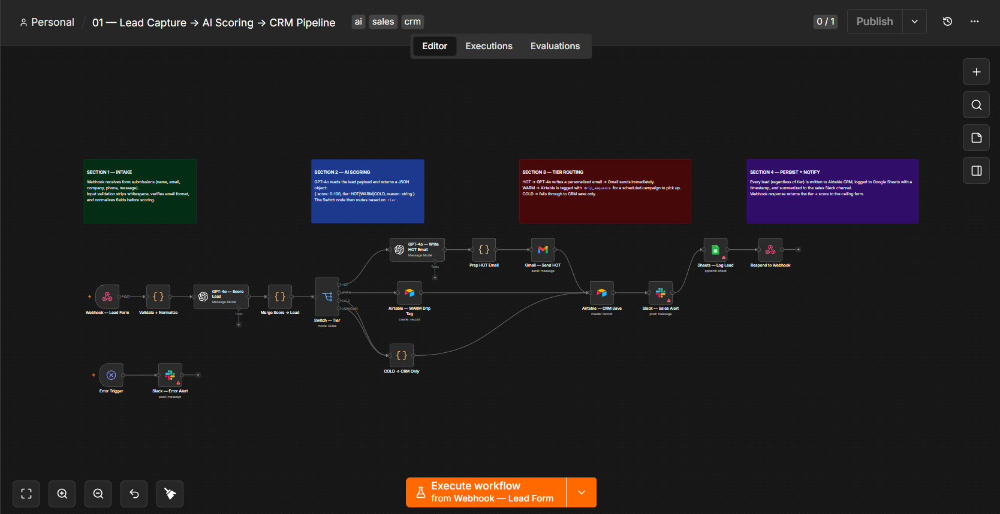

# AI Lead Qualification & Routing System

Webhook-driven pipeline that captures leads, scores them with GPT-4o,
and routes each one automatically — HOT leads get a personalized email
within seconds, WARM leads enter a drip sequence, COLD leads go straight
to CRM.


---

## What it does

A lead submits a form. Within seconds:

- The payload is **validated and normalized** — missing fields and bad
  email formats are rejected before anything reaches the AI
- **GPT-4o scores the lead 0–100** and classifies it as HOT, WARM,
  or COLD with a reason and suggested next step
- **HOT** → GPT-4o writes a personalized outreach email → sent via Gmail
  immediately
- **WARM** → tagged in Airtable with `drip_sequence` for a scheduled
  follow-up campaign
- **COLD** → saved to CRM only, no outreach
- **Every lead** (regardless of tier) is written to Airtable CRM, logged
  to Google Sheets with a timestamp, and summarized to the sales Slack
  channel
- The webhook responds with `{ status, tier, score, received_at }` so
  the calling form can show the user a confirmation

---

## Workflow



---

## Architecture

```
Webhook (POST /lead-intake)
│
▼
Validate + Normalize
│ • strips whitespace
│ • verifies email format
│ • rejects missing fields early
▼
GPT-4o — Score Lead
│ • system prompt: B2B scoring rubric (HOT 75-100, WARM 40-74, COLD 0-39)
│ • returns strict JSON: { score, tier, reason, suggested_next_step }
│ • temperature: 0.2 (deterministic scoring)
▼
Merge Score → Lead
│ • flattens AI output onto lead payload
│ • single object for all downstream nodes
▼
Switch — Tier
├── HOT → GPT-4o writes personalized email → Gmail sends immediately
├── WARM → Airtable drip tag → scheduled campaign picks up
└── COLD → CRM save only
│
▼ (all tiers converge)
Airtable CRM Save → Slack Sales Alert → Google Sheets Log → Respond to Webhook

Error Trigger → Slack Error Alert (fires on any node failure)
```

---

## Scoring rubric

| Tier | Score | Signal |
|---|---|---|
| HOT | 75–100 | Explicit buying intent, decision-maker language, urgency, named budget |
| WARM | 40–74 | Active problem, evaluating options, no urgency |
| COLD | 0–39 | Browsing, student, unclear intent, personal email with no company signal |

---

## Tech stack

| Tool | Purpose |
|---|---|
| n8n | Workflow orchestration |
| GPT-4o (OpenAI API) | Lead scoring + personalized email generation |
| Airtable | CRM records + drip sequence tagging |
| Gmail OAuth2 | HOT lead outreach emails |
| Slack API | Sales alerts + error notifications |
| Google Sheets OAuth2 | Audit log with timestamps |

---

## Setup

### 1. Import the workflow
In n8n → Workflows → Import from File → select `workflow.json`

### 2. Connect credentials
Open each node with a credential slot and connect your own:

| Credential | Node |
|---|---|
| OpenAI API | GPT-4o — Score Lead, GPT-4o — Write HOT Email |
| Gmail OAuth2 | Gmail — Send HOT |
| Airtable Token | Airtable — CRM Save, Airtable — WARM Drip Tag |
| Slack API | Slack — Sales Alert, Slack — Error Alert |
| Google Sheets OAuth2 | Sheets — Log Lead |

### 3. Update IDs
Replace these placeholders with your own:
- Airtable base ID and table ID (in both Airtable nodes)
- Google Sheets document ID (in Sheets — Log Lead)
- Slack channel ID `C0XXXXXXXXX` (in both Slack nodes)

### 4. Activate
Set the workflow to **Active** in n8n.

### 5. Test
```bash
curl -X POST https://YOUR-N8N-INSTANCE/webhook/lead-intake \
  -H "Content-Type: application/json" \
  -d '{
    "name": "Jane Smith",
    "email": "jane@acme.com",
    "company": "Acme Corp",
    "phone": "+1 555 000 0000",
    "message": "We need to automate SDR outreach for 30 reps. Budget approved, looking to move fast."
  }'
```

Expected response:
```json
{
  "status": "received",
  "tier": "HOT",
  "score": 88,
  "lead_id": "jane@acme.com",
  "received_at": "2026-07-21T00:00:00.000Z"
}
```

---

## Scales to

- 5 leads/day (manual testing) → 500 leads/day (production volume)
- Add a second Switch branch to handle `VERY_HOT` for enterprise leads
- Swap Gmail for SendGrid or Resend for higher send limits

---

## License

MIT — free to use, adapt, and deploy.

## Built by

[@Ahmad-Ali-121](https://github.com/Ahmad-Ali-121)
